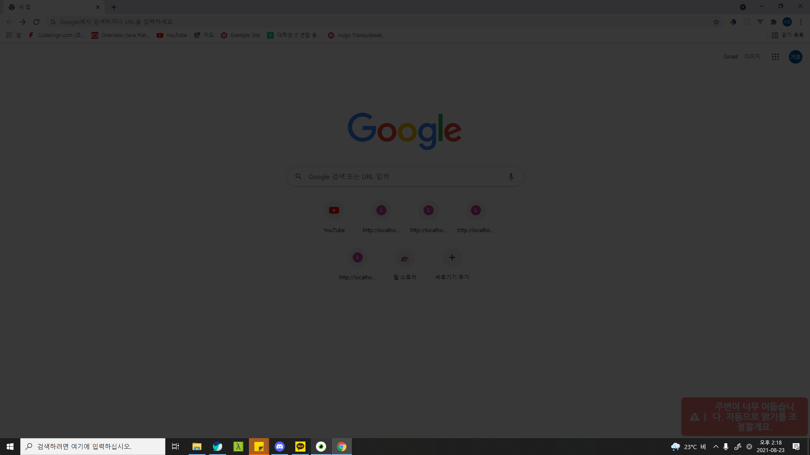

# eye-guardian

[마스코트 캐릭터]

## 빌드하기
```bash
npm run build
```
빌드시 `/dist_electron` 폴더에 설치파일 `eye-guardian Setup 0.1.0`이 생성되며 이를 통해 설치할 수 있습니다.

## 기획의도
현대인의 눈 건강 문제가 대두되는 지금, 올바른 디스플레이 사용 습관을 교정해줄 수 있는 프로그램의 필요성을 느끼게 되었고 이 작품을 기획하게 되었습니다.

## 프로젝트 개요
‘eye-guardian’은 사용자의 눈 건강을 해치는 습관들을 감지 및 교정해주는 프로그램입니다. 저희 팀이 선정한 눈 건강을 해치는 습관과 감지 기준은 다음과 같습니다.
1. 눈 깜빡임 횟수가 평균권장횟수(분당 10 ~ 12회) 이하로 감소   
-> 7초 이상 눈 깜빡임이 감지되지 않으면 사용자에게 경고합니다.   
2. 디스플레이와의 거리가 가까울 때   
-> 사용자의 정자세를 측정하여 정자세 기준 디스플레이와의 거리가 75% 이하가 되면 사용자에게 경고합니다. 
3. 어두운 환경에서 디스플레이를 사용할 때
-> 사용자 주변 환경이 특정 기준값보다 어두워지면 사용자에게 경고합니다.
4. 디스플레이 장시간 사용   
-> 1시간 이상 컴퓨터 사용 시 사용자에게 경고합니다.
5. 블루라이트 노출   
-> 사용자가 조절 가능한 블루라이트 필터를 제공합니다. 

사용자 얼굴 감지에는 tensorflow.js의 face-landmarks-detection 모델을 사용했습니다.  
https://github.com/tensorflow/tfjs-models/tree/master/face-landmarks-detection


● 블루라이트 필터의 경우 필터 세기를 조절할 수 있습니다.  
● 장시간 화면을 사용한 경우 눈 운동 가이드 영상을 보여주는 옵션을 제공합니다.  
● 주변 밝기가 어두워진 경우 자동으로 화면밝기를 조절하는 옵션을 제공합니다.

## 시스템 구성도

## 구현 기능
‘eye-guardian’은 electron desktop framework로 제작된 프로그램으로, main 프로세스 하나와 renderer 프로세스 5개로 구성되어 있습니다. 
main 프로세스는 각 renderer 프로세스의 생성 및 종료를 담당하고 renderer 프로세스 간의 IPC 통신 허브로 이용됩니다. 즉, renderer 프로세스 간 직접적인 통신이 아닌 main 프로세스를 통한 간접적인 통신을 지원합니다. 


renderer 프로세스는 html파일을 기반으로 생성된 서브 프로세스인데, 각 renderer 프로세스는 하나의 윈도우창을 가지며 필요에 따라 숨기는 것이 가능합니다.  
프로그램을 실행하면 main 프로세스는 userInterfaceWindow, warningWindow, screenfilterWindow, stretchguideWindow, faceprocessWindow라는 5개의 renderer 프로세스들을 생성합니다. 다음은 각 renderer 프로세스들에 대한 설명입니다.   

### 1. userInterfaceWindow

 사용자와 상호작용할 수 있는 GUI창입니다.   
(1) :  사용자가 프로그램을 정상적으로 이용할 수 있는 환경인지 알려줍니다.   
카메라 연결, 얼굴감지 모델 불러오기, 정자세 측정, 눈 모양 측정이 완료된 경우 모든 서비스를 정상적으로 이용할 수 있습니다.   
(2) : 경고문 위치를 조정할 수 있습니다.   
(3) : 경고음을 끄거나 켤 수 있습니다.   
(4) : 정자세 기준값과 눈 모양을 측정할 수 있습니다. 두 값은 각각 디스플레이와 사용자의 거리 계산과 눈 깜빡임 감지를 위해 사용됩니다.   
(5) : 각 기능에 대한 경고를 끄거나 켤 수 있습니다. 장시간 화면 사용 경고에 대해서는 경고 발생 시 눈 운동 가이드 영상을 띄우는 옵션을 제공하고, 밝기 경고에 대해서는 경고 발생 시 주변 밝기에 맞추어 자동으로 디스플레이의 밝기를 조절하는 옵션을 제공합니다. 또한 블루라이트 필터를 켰을 때 필터의 세기도 조절할 수 있습니다. 

### 2. warningWindow

화면상에 보여지는 경고를 생성합니다. 경고는 메시지 발생 신호를 수신한 경우 메시지를 사용자에게 보여줍니다. 경고는 3초 간 표시된 후 소멸됩니다. 또한 사용자가 경고음 알람 소리를 켠 경우 경고문과 함께 경고음이 발생합니다. userInterfaceWindow를 통해 경고문의 위치를 설정할 수 있으며  regular-top, regular-bottom, mini 3가지 옵션이 있고, 각각 위 그림과 같은 위치에 경고문을 표시합니다. 


### 3. screenfilterWindow 


화면에 블루라이트 필터와 밝기 조절에 사용되는 필터를 생성합니다. 블루라이트 필터는 userInterfaceWindow에서 블루라이트 필터 옵션을 켠 경우 사용할 수 있으며, 필터세기를 조절할 수 있습니다. 밝기 조절 필터는 밝기 경고 옵션과 밝기 자동조절 옵션을 켰을 때 사용됩니다. 밝기 조절 신호를 수신한 경우 필터를 어둡게 만들어 밝기를 조절합니다.   

### 4. stretchguideWindow

눈 운동 가이드 옵션을 켠 상태로 장시간 화면 사용 경고 신호 수신 시 눈 운동 가이드 영상을 화면에 띄웁니다. 사용자가 가이드 시청을 원하지 않는 경우 종료버튼을 눌러 가이드 영상을 종료할 수 있습니다.

### 5. faceprocessWindow
웹캠으로부터 사용자의 얼굴을 인식하고 특정 행동을 감지하는 백그라운드 프로세스입니다. faceprocessWindow는 카메라와 tensorflow.js/face–landmarks–detection 모델을 성공적으로 불러온 경우 작동을 시작하며, 다음 4가지 항목에 대해 사용자가 눈 건강을 해치는 행동을 한 경우를 감지하여 경고 신호를 발생시킵니다.  

#### 1) 눈 깜빡임 감지

눈 깜빡임 감지는 userInterfaceWindow에서 눈 모양 측정이 완료되어야 작동합니다. 눈 모양 측정은 tensorflow.js/face-landmarks-detection모델이 웹캠화면의 사용자 얼굴을 분석해 사용자의 눈꺼풀 좌표를 리턴하면, 리턴값을 바탕으로 현재 눈꺼풀 사이의 거리(눈의 세로 길이)와 두 눈의 코쪽 눈구석과 귀쪽 눈구석의 거리(눈의 가로 길이)를 계산합니다. 눈의 세로 길이는 눈 깜빡임의 기준이 되고, 눈의 가로 길이는 사용자가 고개를 돌렸는지를 판단하는 기준이 됩니다. 

눈 모양 측정이 완료됐다면, 같은 모델을 이용해 0.08초마다 사용자의 얼굴을 분석합니다. 눈 깜빡임을 분석하는 시간 간격을 0.08초로 둔 이유는 사람의 눈 깜빡임 속도가 평균 0.1초 ~ 0.15초이기 때문에 그 절반으로 설정하였습니다.  

눈을 감았는지 여부는 눈꺼풀 사이의 거리를 통해 알 수 있는데, 현재 눈꺼풀사이의 거리가 사전에 측정된 눈 세로 길이의 60%가 되면 눈을 감았다고 판단했습니다. 
사용자가 고개를 돌려 얼굴이 제대로 인식되지 않는 경우 눈 깜빡임 감지 정확도가 떨어지므로 사용자가 고개를 돌렸는지를 먼저 판단합니다. 사람이 고개를 돌리게 되면 웹캠에 보여지는 눈의 가로 길이는 정면에 비해 줄어들게 됩니다. 이 점을 이용하여 현재 둘 중 한쪽 눈의 가로길이가 사전에 측정된 눈 가로 길이의 2/3이 되면 고개를 돌렸다고 판단하였고 가로길이가 줄어들지 않은 눈만으로 눈을 감았는지 여부를 판단합니다. 고개를 완전히 돌려 한쪽 눈이 완전히 보이지 않게 되면 눈 깜빡임을 감지할 수 없으므로 사용자가 눈을 감았다고 판단하였습니다.   
사용자가 눈을 감지 않는다면 7초 간격으로 경고 신호를 발생시킵니다. 안구건조증 예방을 위해서 성인 기준 분당 10 ~ 12회 깜빡일 것이 권장되는데, 한번 깜빡일 때를 기준으로 시간을 계산하면 깜빡임 간격이 5 ~ 6초이기 때문에 기준을 7초로 설정하였습니다.       

#### 2) 주변 밝기 감지 

사용자의 주변 밝기를 감지하고 주변 환경이 어두울 때 경고 신호를 발생시킵니다. 컴퓨터에는 조도 센서가 없기 때문에 이미지를 HSP공식을 이용하여 흑백으로 변환시켜 어두운 지 여부를 계산합니다. HSP공식은 Adobe의 포토샵 프로그램에서 이미지를 흑백으로 변환할 때 쓰이는 계산식으로 다음과 같습니다. 

저희는 웹캠을 통해 5초마다 이미지를 받고 이미지 모든 픽셀의 RGB값의 평균을 HSP공식에 적용한 결과값(0~255)을 통해 명도를 계산하고 주변이 밝은 지 여부를 판단했습니다. 경고가 발생할 때 자동 밝기 조절 옵션이 켜져 있으면 주변 환경 밝기에 맞춰서 자동으로 디스플레이의 밝기를 조절해줍니다. 최초 경고 발생 이후 주변 밝기 상태가 개선될 때까지 5분 간격으로 경고를 띄웁니다. 

#### 3) 디스플레이 사용 시간 감지

tensorflow.js/face-landmarks-detection 모델을 이용해 사용자의 얼굴이 인식되는 시간을 측정합니다. 불필요한 중복 연산을 피하기 위해 눈 깜빡임 감지에서 분석한 값을 재활용합니다.  
1초 간격으로 사용자의 얼굴을 확인하여 1시간 이상 인식되는 경우 즉, 사용자가 1시간 이상 디스플레이를 사용한 경우 경고 신호를 발생시킵니다. 이 때 눈 운동 가이드 옵션이 켜져 있다면 눈 운동 가이드 실행 신호도 같이 발생시킵니다. 사용자가 자리를 비우거나 고개를 돌려 다른 곳을 바라보는 등 5분 이상 디스플레이를 사용하지 않는 경우 누적 시간이 초기화 됩니다. 화장실을 가거나 휴대폰을 사용하는 등 잠시 디스플레이를 사용하지 않는 경우가 있을 수 있는데, 이때는 사용자가 휴식을 취하고 있다고 판단하기 어렵기 때문에  5분의 유예시간을 두었습니다. 

#### 4) 디스플레이와 사용자 간의 거리 감지

디스플레이와 사용자 간의 거리 감지는 userInterfaceWindow에서 정자세 측정이 완료되어야 작동합니다. 정자세 측정은 tensorflow.js/face-landmarks-detection모델을 이용해 사용자 두 눈 사이의 거리를 계산합니다. 정자세 측정이 완료되었다면 5초마다 사용자와 디스플레이의 거리가 가까워졌는지를 판단합니다. 현재 사용자의 두 눈 사이의 거리가 사전에 측정된 눈 사이 거리의 4/3보다 커지면 사용자가 디스플레이에 가까워졌다고 판단하며, 이 상태가 15초 이상 유지될 경우 5초마다 화면 접근 경고 신호를 발생시킵니다.  
> 정자세 디스플레이 거리(b) : 가까워진 디스플레이 거리(3/4b)   
= 가까워진 눈 사이 거리(4/3a) :  정자세 눈 사이 거리(a)

* 위 항목들은 userInterfaceWindow에서 옵션을 통해 끄거나 켤 수 있으며, 꺼져 있을 경우 작동하지 않습니다.

## 사용 환경
- window10 이상
- 웹캠이 연결되어 있어야함

## 개발 환경

Hardware
 - 웹캠
 - 데스크톱 / 노트북

OS 
 - Windows 10

Library 
 - tensorflow.js/face-landmark-detection

Framework
 - electron v.13.0.0
 - vue.js v.3.0.0
 - Vue CLI Plugin Electron Builder
 https://nklayman.github.io/vue-cli-plugin-electron-builder/

## 개발자
김현호 @spaff13

유동원 @Tuna-is-DW

양기조 @dev2820 (second28200@gmail.com)

본 프로젝트는 숭실대학교 컴퓨터학부 소프트웨어공모전 출품작이며 더 이상의 업데이트는 없음을 알려드립니다.

